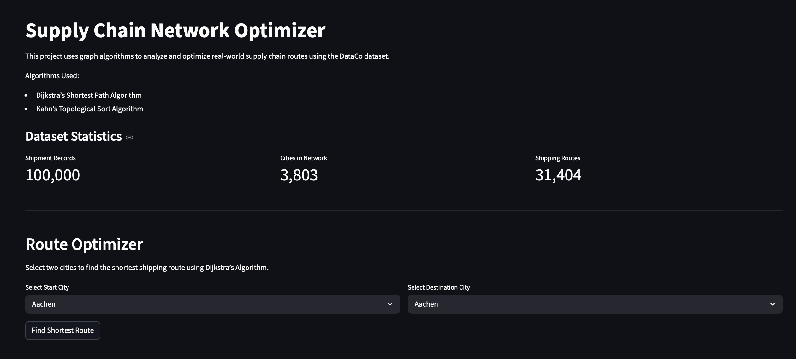
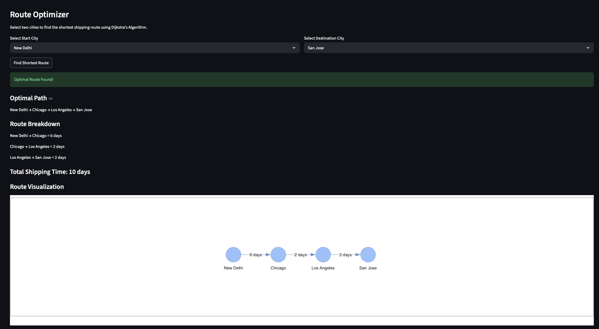
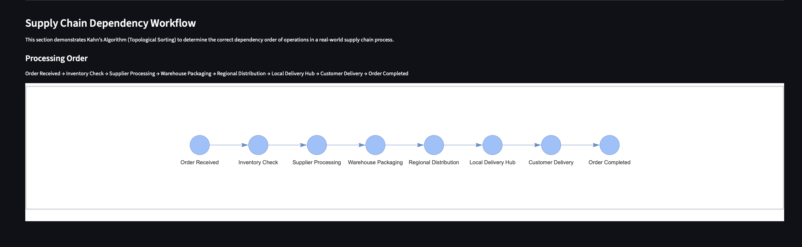

# Supply Chain Network Optimizer

## Project Overview

The Supply Chain Network Optimizer is a graph-based logistics analysis application built using Python, Streamlit, and real-world supply chain shipment data.

This project demonstrates how graph algorithms can be applied to optimize shipping routes and model supply chain workflows.

The application uses:

* **Dijkstra’s Shortest Path Algorithm** for route optimization
* **Kahn’s Topological Sort Algorithm** for supply chain dependency ordering

The project is designed for a non-technical audience and visualizes how products move through a logistics network.

---

# Features

## Route Optimization

Users can:

* Select a start city
* Select a destination city
* Find the shortest shipping route
* View shipping time between intermediate cities
* Visualize the optimized route graphically

The application uses Dijkstra’s Algorithm to minimize total shipping time.

---

## Supply Chain Workflow Visualization

The project also demonstrates Kahn’s Algorithm (Topological Sorting) using a supply chain dependency workflow.

This section models the correct order of operations in a logistics system:

Order Received → Inventory Check → Supplier Processing → Warehouse Packaging → Regional Distribution → Local Delivery Hub → Customer Delivery → Order Completed

This demonstrates how dependency ordering can be represented using Directed Acyclic Graphs (DAGs).

---

## Dataset Analytics

The application includes dataset statistics and logistics analytics such as:

* Number of shipment records
* Number of cities in the network
* Number of shipping routes
* Top shipment-origin cities

---

# Algorithms Used

## 1. Dijkstra’s Shortest Path Algorithm

### Purpose

Used to find the fastest shipping route between two cities.

### Graph Representation

* Nodes = Cities
* Edges = Shipment routes
* Edge Weights = Shipping time in days

### Output

The algorithm returns:

* Optimal path
* Intermediate cities
* Total shipping time

---

## 2. Kahn’s Topological Sort Algorithm

### Purpose

Used to determine the correct dependency order of operations in a supply chain workflow.

### Graph Representation

* Nodes = Workflow stages
* Edges = Dependency relationships

### Output

The algorithm returns the valid processing order of the supply chain workflow.

---

# Dataset

This project uses the **DataCo Supply Chain Dataset**.

The dataset contains:

* Shipment records
* Order cities
* Customer cities
* Shipping information
* Delivery status
* Product and logistics metadata

The dataset was preprocessed to extract only relevant graph-related features.

---

# Technologies Used

* Python
* Streamlit
* Pandas
* NetworkX
* PyVis
* Git & GitHub

---

# Project Structure

```text
supply-chain-network-optimizer/
│
├── algorithms/
│   ├── dijkstra_algorithm.py
│   └── kahn_topological_sort.py
│
├── app/
│   └── streamlit_app.py
│
├── data/
│   └── cleaned_supply_chain_data.csv
│
├── preprocess_data.py
├── build_graph.py
├── inspect_dataset.py
├── test_dijkstra.py
├── test_topological_sort.py
├── requirements.txt
└── README.md
```

---

# Setup Instructions

## 1. Clone Repository

```bash
git clone https://github.com/mit4444/supply-chain-network-optimizer.git
cd supply-chain-network-optimizer
```

---

## 2. Create Virtual Environment

### macOS/Linux

```bash
python3 -m venv .venv
source .venv/bin/activate
```

### Windows

```bash
python -m venv .venv
.venv\Scripts\activate
```

---

## 3. Install Dependencies

```bash
pip install -r requirements.txt
```

---

## 4. Run the Application

```bash
streamlit run app/streamlit_app.py
```

---

# Example Use Case

Example route optimization:

Townsville → Baltimore → Philadelphia

The application calculates:

* Intermediate routing nodes
* Shipping time between cities
* Total optimized shipping duration

---

# Screenshots


* Main dashboard

* Route optimization result

* Kahn’s Algorithm workflow visualization

---

# AI Usage Statement

AI-assisted tools were used for:

* Debugging support
* UI refinement suggestions
* Code organization assistance
* Documentation refinement

Core project design, algorithm selection, implementation decisions, testing, integration, and final application development were completed manually by the project authors.

---

# Future Improvements

Possible future improvements include:

* Live map-based route visualization
* Real-time logistics tracking
* Delivery risk prediction
* Cost-based route optimization
* Cloud deployment
* Larger-scale distributed graph processing

---

# Authors

* Mit Gandhi
* Dharmesh Sharma

---

# Repository Requirements Checklist

* [x] Source code included
* [x] Setup instructions included
* [x] Graph algorithms implemented
* [x] Interactive application created
* [ ] Proposal file added to repository
* [ ] Presentation file added to repository
* [ ] Final demo video added/shared
